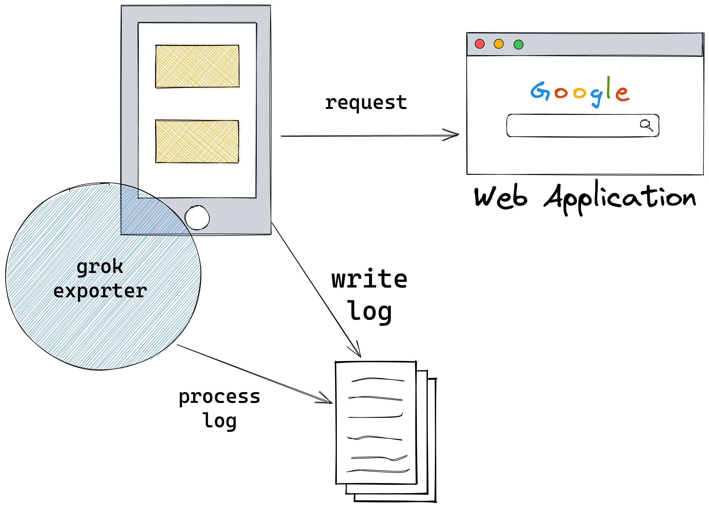

# How to export Apache metrics

I created this project to learn how to use the [grok_exporter](https://github.com/fstab/grok_exporter) tool.

`grok exporter`'s main goal is to parse lines from unstructed logs and send all the data to a processor that can
manipulate the data the way you want.

Why not use *ELK*? Well, not everyone has enough knowledge to run this stack. Also, some other companies invest more money in tools like *Prometheus*.



## Running

This project has three components:
* Apache web server
* Web application ([httpbin](https://httpbin.org/))
* grok exporter

Apache and grok share the same volume so the container running grok can find and parse the Apache access log file.

```
docker-compose up
```

## Testing

We can make some requests to the web application.

More information on all routes this web application exposes: [httpbin](https://httpbin.org/)

```
curl localhost:8080/get
curl localhost:8080/get
curl localhost:8080/status/200
curl localhost:8080/status/404
curl localhost:8080/status/404
curl localhost:8080/status/500
curl --data "" localhost:8080/post
curl --data "" localhost:8080/post
curl localhost:8080/delay/1
curl localhost:8080/delay/2
```

Viewing the Prometheus metrics:

```
curl localhost:9144/metrics
```
